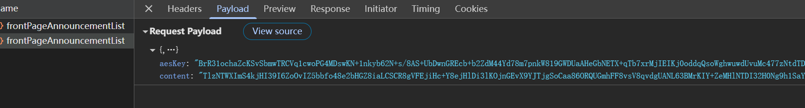
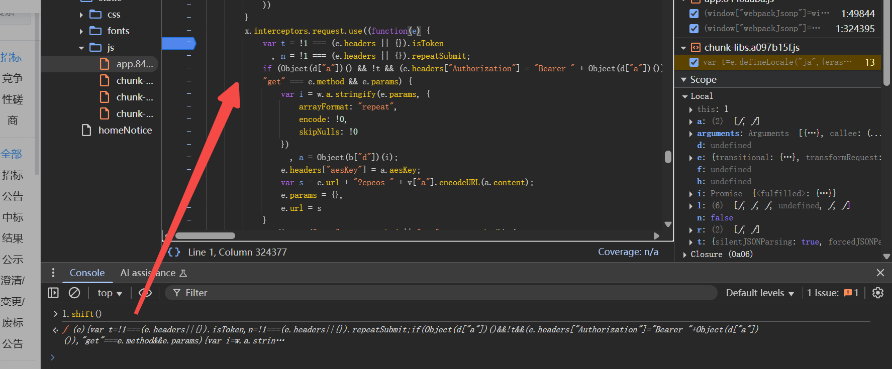
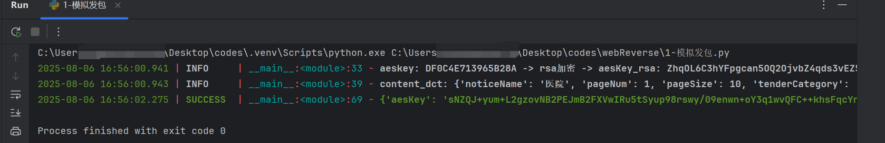
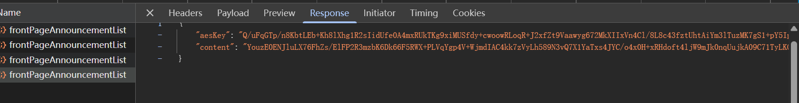
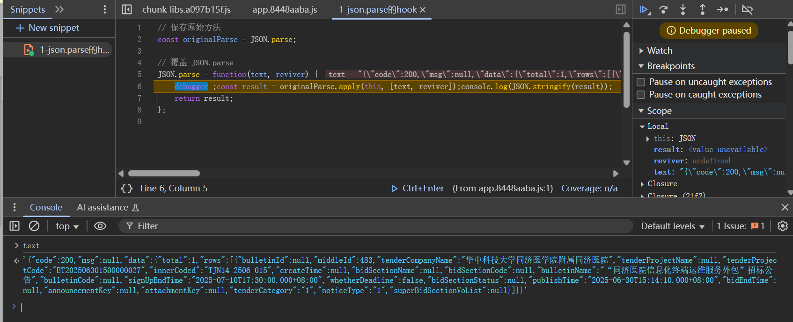
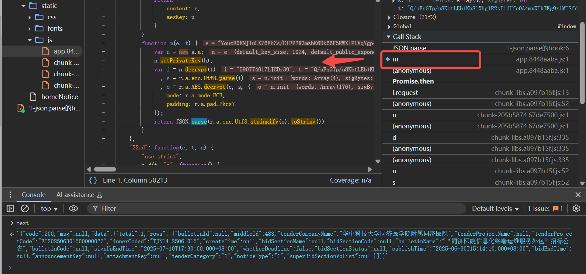

# 网站分析


https://zbb.tjhonline.com.cn/homeNotice


关键词搜索


请求头没啥有用参数，有个aesKey



前面的aesKey和请求体的是一样的，所以只看请求体就行了


响应的数据也是这种，看名字就知道是aes了


# 请求体参数逆向

直接跟栈


挨个跟，寻找请求体生成位置


跟到异步，这里直接看 `l.shift()` 就行



断点然后调试一下


找到了明文，然后找一下加密位置


进到这里，说明 `Object(b["d"])`就是加密函数


跳转过去

打上断点，这是个aes，ecb模式，只需要关注明文和key就行

- 明文: `i -> e`

  ```js
  e = {"noticeName":"医院","pageNum":1,"pageSize":10,"tenderCategory":"1","noticeTypeList":null,"tenderClass":null}
  ```

- key: `n->t->Object(o["h"])(16, 16)`

  这是个随机的，一直在变化

然后我们返回值

```js
return {
    content: c,
    aesKey: u
}
```

- key: `u -> l.encrypt(t) -> t`

  这里的t就是前面的随机16长度的十六进制字符串

- 密文: `c->s`

  s就是aes加密后的数据


接下来看 `l.encrypt`

公钥是`l.setPublicKey(p)`的`p`

```python
p = "MIGfMA0GCSqGSIb3DQEBAQUAA4GNADCBiQKBgQCC3Lb0O4zgEakDfJ4XJO5zadXep9bQeWyJ6pa0e328PYQYZgLNP7eVrAP7mVZgG+8D4MicIcStTQnBxF8AEyJKrh/M/3WSSK2zDvrZn1paWf4SA8zFIn5cuYlcUH+WuxghQn3kKRUW2qtBY9eaGF5qntascctNgQTHmW3eqQzDBQIDAQAB"
```

然后做了一个rsa的加密


接下来就是写python代码了

```python
import random

import requests
import json
import base64

from Crypto import Random
from Crypto.PublicKey import RSA
from Crypto.Cipher import PKCS1_v1_5
from Crypto.Cipher import AES
from Crypto.Util.Padding import pad, unpad

from loguru import logger


def rsa_ecb_encrypt(plain_bytes: bytes, public_key_b64: str) -> bytes:
    public_key_pem = base64.b64decode(public_key_b64)
    public_key = RSA.importKey(public_key_pem)

    cipher = PKCS1_v1_5.new(public_key)
    ciphertext = cipher.encrypt(plain_bytes)

    return ciphertext


def aes_ecb_encrypt(plain_bytes: bytes, aes_key: bytes) -> bytes:
    return AES.new(aes_key, AES.MODE_ECB).encrypt(pad(plain_bytes, AES.block_size))


url = "https://zbb.tjhonline.com.cn/tjh/purchaser/public/frontPageAnnouncementList"

aesKey = "".join(random.sample("0123456789abcdef", 16)).upper()
public_key_b64 = "MIGfMA0GCSqGSIb3DQEBAQUAA4GNADCBiQKBgQCC3Lb0O4zgEakDfJ4XJO5zadXep9bQeWyJ6pa0e328PYQYZgLNP7eVrAP7mVZgG+8D4MicIcStTQnBxF8AEyJKrh/M/3WSSK2zDvrZn1paWf4SA8zFIn5cuYlcUH+WuxghQn3kKRUW2qtBY9eaGF5qntascctNgQTHmW3eqQzDBQIDAQAB"
aesKey_rsa_b64 = base64.b64encode(rsa_ecb_encrypt(aesKey.encode(), public_key_b64)).decode()
logger.info(f"aeskey: {aesKey} -> rsa加密 -> aesKey_rsa: {aesKey_rsa_b64}")

content_dct = {"noticeName": "医院", "pageNum": 1, "pageSize": 10, "tenderCategory": "1", "noticeTypeList": None,
               "tenderClass": None}
content_str = json.dumps(content_dct, separators=(',', ':'))
content_b64 = base64.b64encode(aes_ecb_encrypt(content_str.encode(), aesKey.encode())).decode()
logger.info(f"content_dct: {content_dct} -> aes/cbc处理, aesKey: {aesKey} -> content_b64: {content_b64}")

headers = {
    "Accept": "application/json, text/plain, */*",
    "Accept-Language": "zh-CN,zh;q=0.9",
    "Connection": "keep-alive",
    "Content-Type": "application/json;charset=UTF-8",
    "Origin": "https://zbb.tjhonline.com.cn",
    "Referer": "https://zbb.tjhonline.com.cn/homeNotice",
    "Sec-Fetch-Dest": "empty",
    "Sec-Fetch-Mode": "cors",
    "Sec-Fetch-Site": "same-origin",
    "User-Agent": "Mozilla/5.0 (Windows NT 10.0; Win64; x64) AppleWebKit/537.36 (KHTML, like Gecko) Chrome/138.0.0.0 Safari/537.36",
    "sec-ch-ua": "\"Not)A;Brand\";v=\"8\", \"Chromium\";v=\"138\", \"Google Chrome\";v=\"138\"",
    "sec-ch-ua-mobile": "?0",
    "sec-ch-ua-platform": "\"Windows\""
}
headers["aesKey"] = aesKey

cookies = {
    "sidebarStatus": "0"
}
data = {
    "content": content_b64,
    "aesKey": aesKey_rsa_b64
}

data = json.dumps(data, separators=(',', ':'))
response = requests.post(url, headers=headers, cookies=cookies, data=data)

logger.success(response.json())
```




目前没看出啥问题，接着就是解密响应体了


# 解密响应体


我们猜测响应体解密后是json格式的，所以直接hook一下 `JSON.parse`




对比抓包，一样的


这个是响应体的json，我们跳过，找到解密好的那个



然后跟栈回溯



这里也是rsa+aes

aes的key是rsa解密了响应体的aesKey拿到的

也就是 `t->i`

这里的私钥是h，控制台打印就能拿到了

```js
h = "MIICdwIBADANBgkqhkiG9w0BAQEFAASCAmEwggJdAgEAAoGBALROqKeWuu+G6z6V7lesaAIC8FWWJ8qYRRy4HbbakJBH+OEWfD+0/MmMnZ28aMiV3qDy34SLfddDxvWJo/SR8iL8bjeqOEQxenu8Ogec+290w4F8IW6Ips/kZ5pnkg/TUn1GATOSV+RbB90okuykbBEbGKaNqGczJ/lI7RpfNvCpAgMBAAECgYA9RzJYaoizmRXgGlJ7Z3Odo2QMolB5sRBj90rZ9yQEdQFndh3aBOeYk/qJPhwad5zG9GP0hvfIrhczIYkgOG2i1ZvBAFBP7IZiGJz5PxS9QOFPg926sI6Mv3nBIS0+U88IyzPL/fQWNvhc3b9Y95kYp4p0Wk4zzNe9HNNUMQHdUQJBAOwA6EoVSlxlpNivoAGrMynLlnHmZ7fEpXXQINUbhpX8+I3fazoWcRaYpfLmVKa82DJXHUe8URFX3oir3kAocVUCQQDDlahWFmYmtNYqLitJdIdltTcmQtAgHlfshdYnq6Gg8jSjwh40sXF8MgZfG03+sfdmKbSG3e+7Ihb/X5P/odIFAkEAlz3Rn0BbojDlXpPWN5uOMzesFxwv1Z3o50JU+B0mt9IhO1I1dklRecijeLFRCHW3GzOmqQUu8q1cCDwUNwtz7QJBAJ3BT8coR/q+b+QT20xjVnaeBT6yM2dEskyP4x2aXUMROY5Am9aKrWuseeEqh+2ApHld+EO0LZJ2O7B96kUNw/UCQHhXTTBHc2HkyU84U2+OAB2hJtJBmj+eGl0iqNfOq3JyiIemC/bV74sASLa+NN9CJRotBh9jzmzNpwEi24Y8KHE="
```


接下来就是写python代码了

```python

def rsa_ecb_decrypt(cipherd_bytes: bytes, private_key_b64: str) -> bytes:
    private_key_pem = base64.b64decode(private_key_b64)
    private_key = RSA.import_key(private_key_pem)
    cipher = PKCS1_v1_5.new(private_key)
    decrypted_bytes = cipher.decrypt(cipherd_bytes, Random.new().read(16))
    return decrypted_bytes

def aes_ecb_decrypt(cipher_bytes: bytes, aes_key: bytes) -> bytes:
    return unpad(AES.new(aes_key, AES.MODE_ECB).decrypt(cipher_bytes), AES.block_size)


private_key_b64 = "MIICdwIBADANBgkqhkiG9w0BAQEFAASCAmEwggJdAgEAAoGBALROqKeWuu+G6z6V7lesaAIC8FWWJ8qYRRy4HbbakJBH+OEWfD+0/MmMnZ28aMiV3qDy34SLfddDxvWJo/SR8iL8bjeqOEQxenu8Ogec+290w4F8IW6Ips/kZ5pnkg/TUn1GATOSV+RbB90okuykbBEbGKaNqGczJ/lI7RpfNvCpAgMBAAECgYA9RzJYaoizmRXgGlJ7Z3Odo2QMolB5sRBj90rZ9yQEdQFndh3aBOeYk/qJPhwad5zG9GP0hvfIrhczIYkgOG2i1ZvBAFBP7IZiGJz5PxS9QOFPg926sI6Mv3nBIS0+U88IyzPL/fQWNvhc3b9Y95kYp4p0Wk4zzNe9HNNUMQHdUQJBAOwA6EoVSlxlpNivoAGrMynLlnHmZ7fEpXXQINUbhpX8+I3fazoWcRaYpfLmVKa82DJXHUe8URFX3oir3kAocVUCQQDDlahWFmYmtNYqLitJdIdltTcmQtAgHlfshdYnq6Gg8jSjwh40sXF8MgZfG03+sfdmKbSG3e+7Ihb/X5P/odIFAkEAlz3Rn0BbojDlXpPWN5uOMzesFxwv1Z3o50JU+B0mt9IhO1I1dklRecijeLFRCHW3GzOmqQUu8q1cCDwUNwtz7QJBAJ3BT8coR/q+b+QT20xjVnaeBT6yM2dEskyP4x2aXUMROY5Am9aKrWuseeEqh+2ApHld+EO0LZJ2O7B96kUNw/UCQHhXTTBHc2HkyU84U2+OAB2hJtJBmj+eGl0iqNfOq3JyiIemC/bV74sASLa+NN9CJRotBh9jzmzNpwEi24Y8KHE="
# aesKey_rsa_b64 = "Q/uFqGTp/n8KbtLEb+Kh8lXhg1R2sIidUfe0A4mxRUkTKg9xiMUSfdy+cwoowRLoqR+J2xfZt9Vaawyg672MkXIIxVn4Cl/8L8c43fztUhtAiYm3lTuzMK7gS1+pY5Ipcnye/+D3tMjRYNoC3WqL3wRn68w83MbJpUh7HlahAdI="
aesKey_rsa_b64 = response.json()["aesKey"]
aesKey = rsa_ecb_decrypt(base64.b64decode(aesKey_rsa_b64), private_key_b64).decode()
content_aes_b64 = response.json()["content"]
res = aes_ecb_decrypt(base64.b64decode(content_aes_b64.encode()), aesKey.encode()).decode()

logger.success(f"解密响应体为: {res}")
```


完整代码见py文件，收工