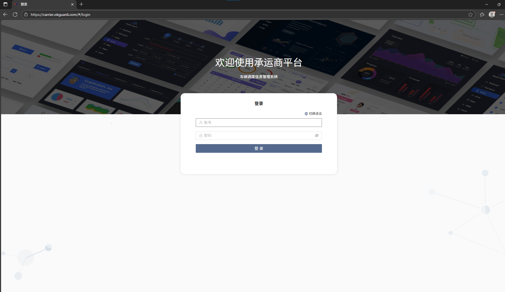
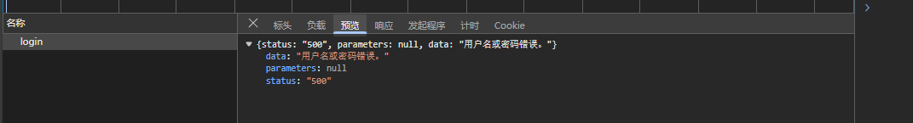
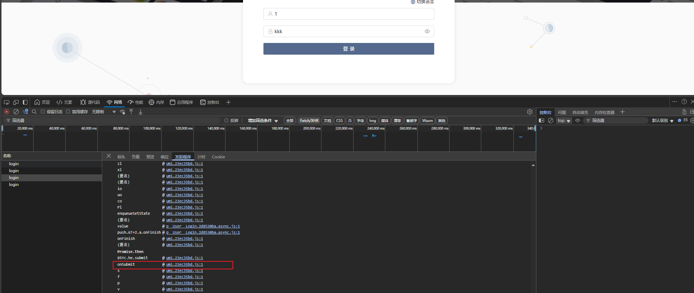
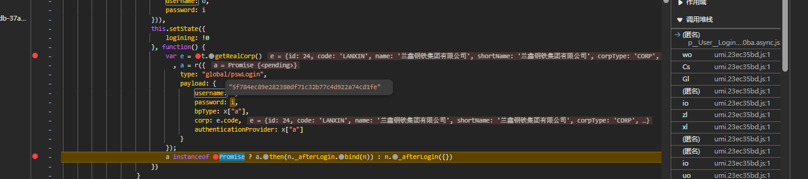
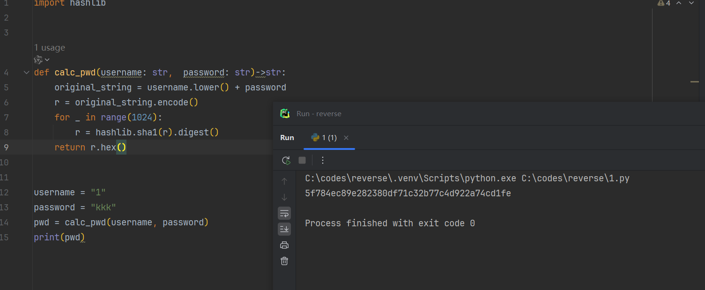
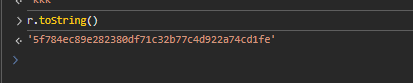

https://carrier.okguanli.com/#/login

请求体密码加密了

请求头没东西

响应体正常返回

主要就是这个密码加密

定位起来很麻烦，只能挨个跟栈

由于是表单，从表单开始

挨个找，最后找到这里来

这里的e还是明文

继续看这个login函数

进来之后就是这里了，

已经加密了，所以去找上面的i赋值位置

所以就是`Object(C["S"])`函数加密的，控制台输入后跳转过去

这里名字很清楚了，做了1000次sha1，

r是用户名小写+密码，然后1024次sha1

接下来就是python实现了

正确的

接下来发包就行

搞定！