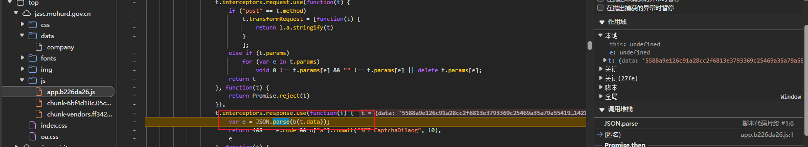
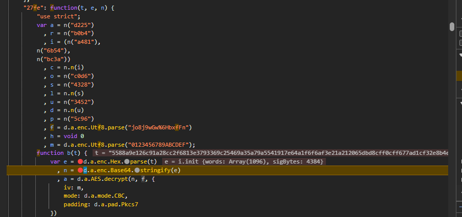
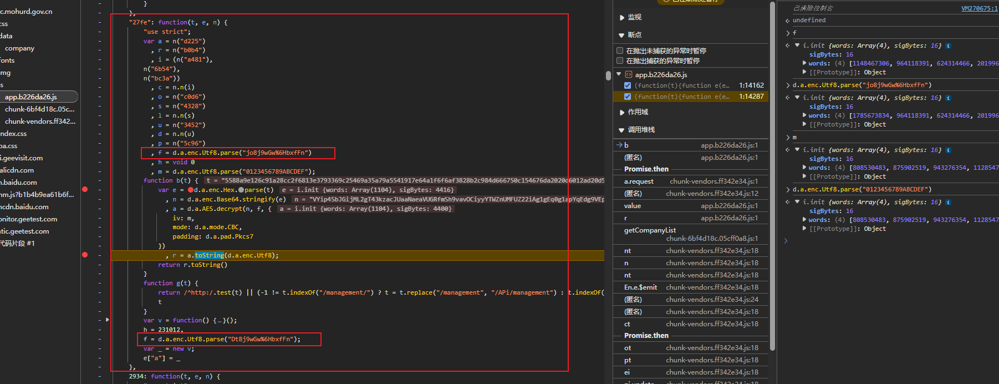
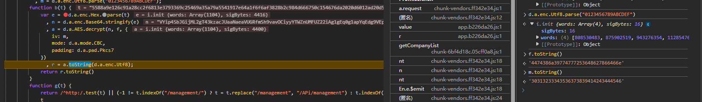
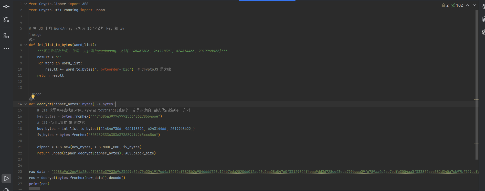
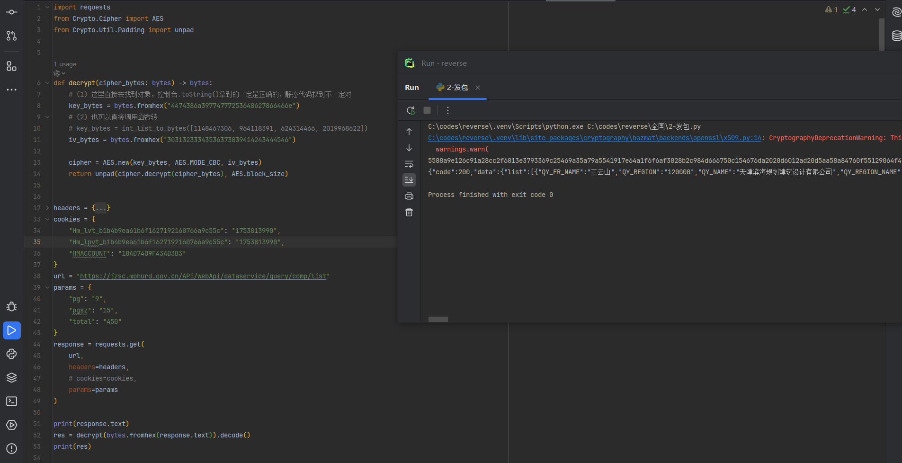

gov网站，单纯技术分析，请勿拿去搞非法活动，本人不负责；


点击分页，然后抓包分析一下；响应体加密了；

我们利用up主：[小爬菜咦](https://space.bilibili.com/3546924980373556/) 提供的脚本对 `JSON.parse` 进行hook


加一个代码片段，然后右键run


跳过其他不正确的断点，然后走到这里来；继续跟栈




核心就看b函数是如何解密的


先把t根据十六进制进行解析为e，再把e加密为b64字符串n；再把n进行aes解密，key是f，模式是cbc，iv是m；



key是 `jo8j9wGw%6HbxfFn`， iv是 `0123456789ABCDEF`；密文是用hex进行解析然后转b64，再解密；

> 这里的转b64是因为js端用的加密库多此一举，实际上不用管；

那就写代码呗，这里直接写py代码了


发现有问题；经过雨大帝的指点，说是iv可能有问题；


经过仔细的对比，发现是key除了问题；

这里找了一下原因；



这里有一个key进行了干扰，实际上这个b函数当时只是被定义了没执行，所以下面的代码也一样会走到；

然后等执行b函数的时候，他已经走了两个f的赋值了；所以下次遇到这种要小心一点，最好是根据右侧对比；


更好的办法是，直接把对应的key和iv进行反解成字符串或字节；

蛋总群群友给了我一个python代码

```python
def int_list_to_bytes(word_list):
    """蛋总群群友给的；使用：去js端扣wordarray，类似[1148467306, 964118391, 624314466, 2019968622]"""
    result = b''
    for word in word_list:
        result += word.to_bytes(4, byteorder='big')  # CryptoJS 是大端
    return result
```

这样就能直接转了；


更方便的应该是直接在控制台把这个wordarray对象执行toString方法，拿到十六进制字符串



然后拿到python中使用bytes.fromhex()就能转成字节进行加解密了；



最终代码是这样；


接下来去network中复制请求的curl(bash)命令，拿去爬虫工具库转py代码


有个cookie，其他没啥特别的，所以不用怎么管；测试发现没啥大用



这样就行了，接下来就是自己去分析一下url中的参数，也就是代码中的params了