# 抓包分析


依然gov

[广东省公共资源交易平台](https://ygp.gdzwfw.gov.cn/#/44/jygg)：https://ygp.gdzwfw.gov.cn/#/44/jygg

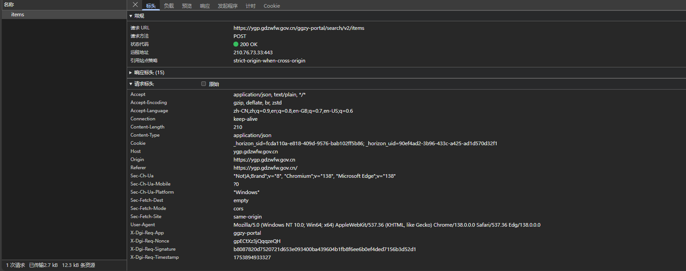

请求头有一些参数

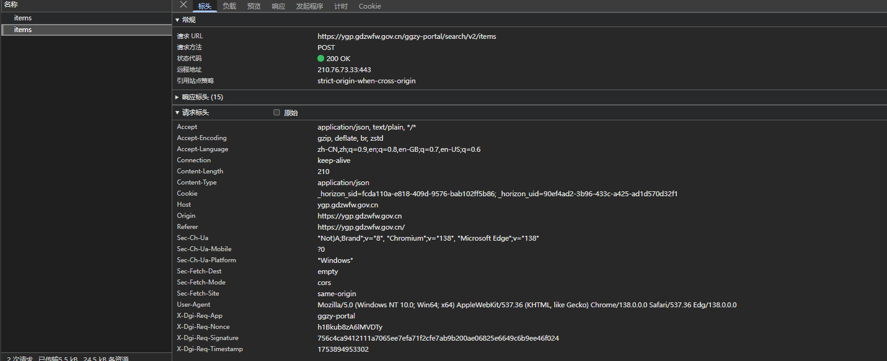

两次对比，发现

```python
X-Dgi-Req-Nonce: h1Bkub8zA6lMVDTy
X-Dgi-Req-Signature: 756c4ca9412111a7065ee7efa71f2cfe7ab9b200ae06825e6649c6b9ee46f024
X-Dgi-Req-Timestamp: 1753894953302
```

这三个在变


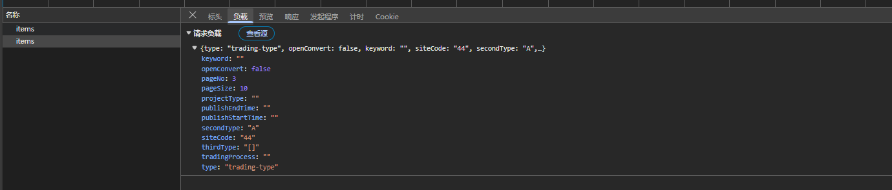

请求头明文

如果翻页

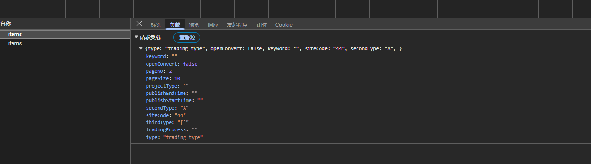

变得就是pageNo


响应体也是直接拿到的；


# 参数分析

## X-Dgi-Req-Nonce

看这名字就知道是随机的，数一下长度，16个，随机16长度字符串就行；


## X-Dgi-Req-Timestamp

毫秒级时间戳


## X-Dgi-Req-Signature

签名在变化，如果是hash算法，数一下长度是64，字符全是16进制，所以是32字节，32*8=256位，

猜测sha256，由于是gov，可能是sm3


给sha256全部打上断点，结果都不走。。

搜sm3没有；

所以只能跟栈了

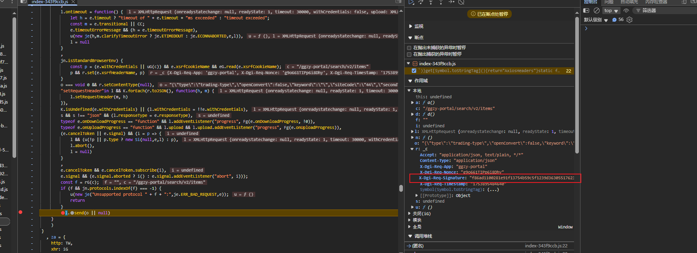

第一个里面，r包含了签名，去找一下r的生成

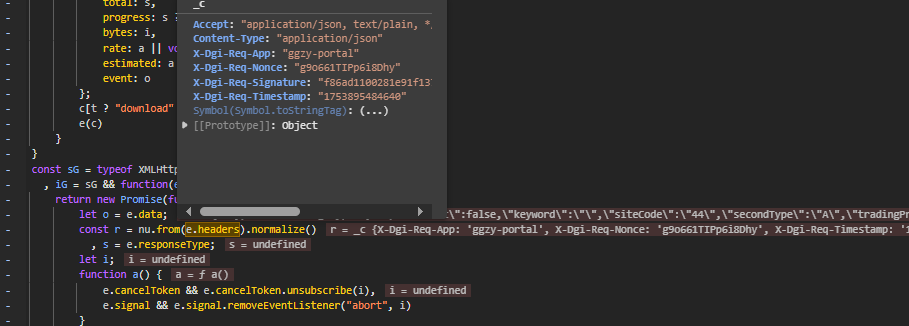

往上翻就可以看到，这里e.headers里面已经有生成好的了，继续跟e，e是函数传进来的


打上断点跟栈

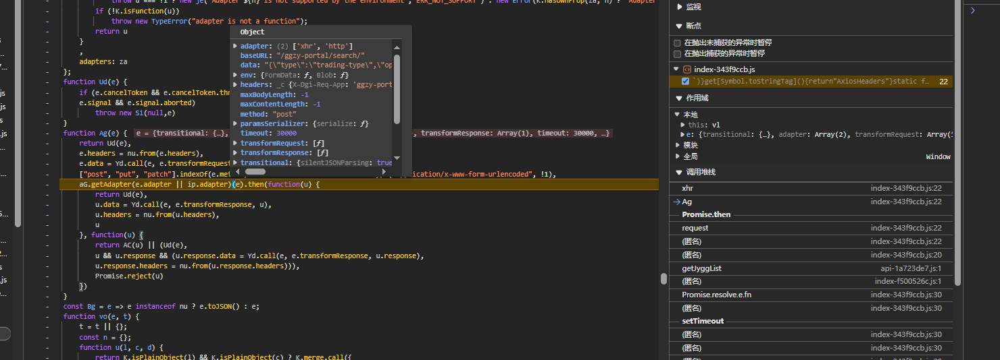

继续找，发现还是上一个传过来的


跟到异步了，我们直接打印`h[d]`就行

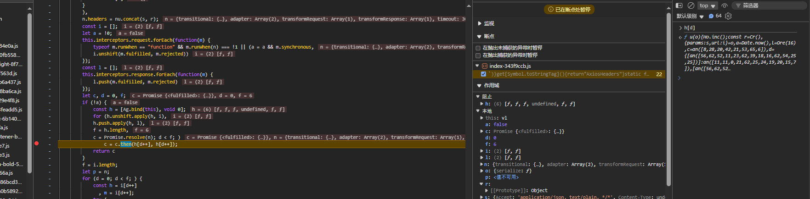


这里没有参数，说明就是在这个里面生成的


没啥好说的，这个d里面就包含了签名，这里是wordArray形式的


可以去和抓包比对一下，这里懒得对了，就是这里；


这里就有nonce了，但是没看到sign

往下看看

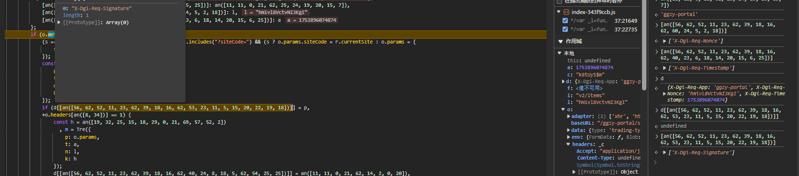

这里就有了，是p


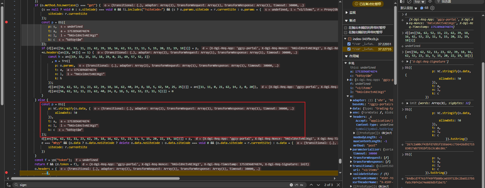

注意是下面那个，我们这个请求时post

```js
p = D1({
    p: VC.stringify(o.data, {
        allowDots: !0
    }),
    t: a,
    n: l,
    k: c
})
```

这个o.data是请求体


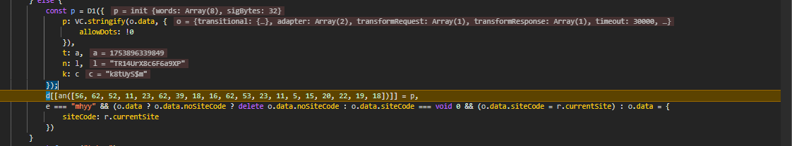

a是时间戳，l是随机nonce，c像是固定的


接下来去看看D1

t是请求体拼接成字符串，n是时间戳，u是nonce，o是固定的


这个`qF` 像是排序了

然后拼接起来再走 `eF`


```python
salt_string = "k8tUyS$m"
sign_original_string = f"{nonce_string}{salt_string}{body_string}{timestamp_ms_string}"
```

接下来分析`eF`

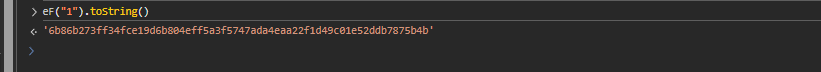

我们去爬虫工具库看看

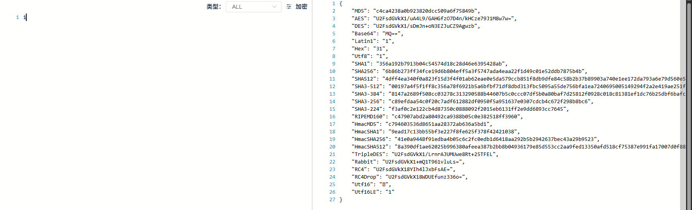

很明显是  `sha256`

写一下python代码吧


搞定


