# 抓包分析

https://www.dxy.cn/bbs/newweb/pc/home

打开抓包就有一个检查登录信息的包

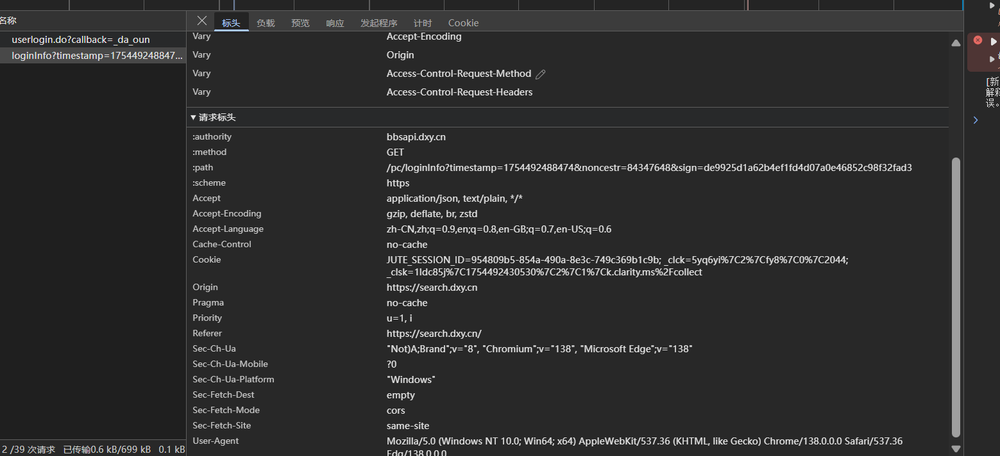

请求头没啥东西

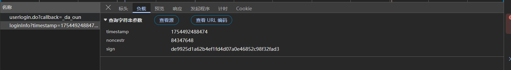

请求体也没啥东西，主要是sign，nonce肯定是随机的

刷新网站

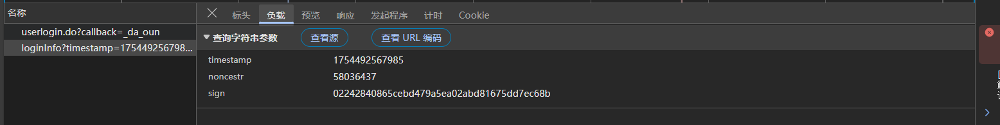

接下来去搞定这个sign就行

# sign逆向

跟栈不好找

搜索的话，搜sign也没那么方便，所以我们搜nonceStr

然后这里就看js文件就行，第一个

右键，到source中查看

第这里就找到了o.sign了（这个js是分发下来的，所以名字啥的会变）

刷新页面

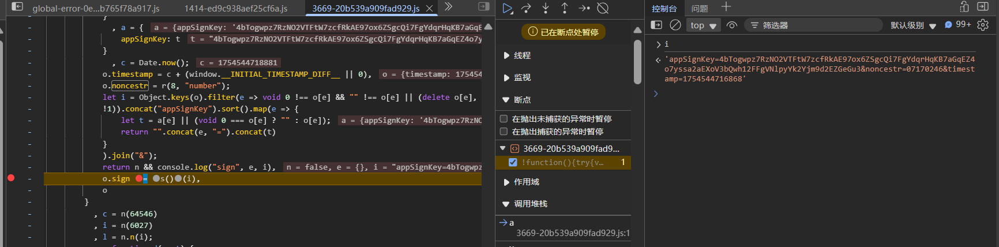

这里就是最外层明文了

接下来看s()

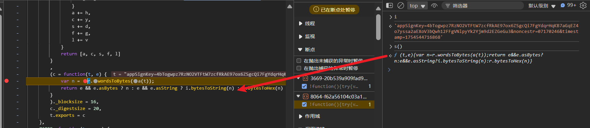

这里先走了 `a`再走了 `r.wordsToBytes`

我们直接扣代码吧

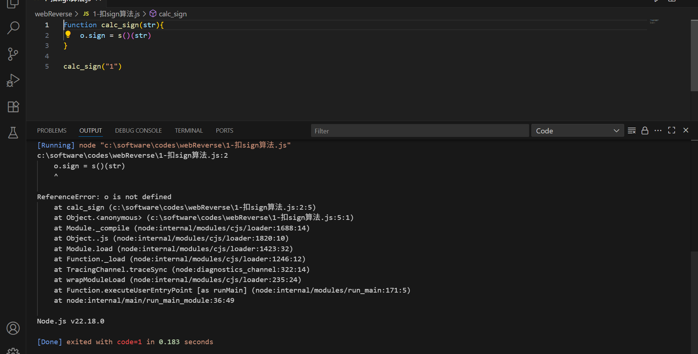

先扣外层的，这里o和s()需要处理

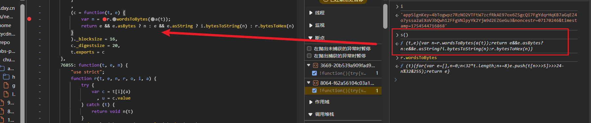

代码扣下来

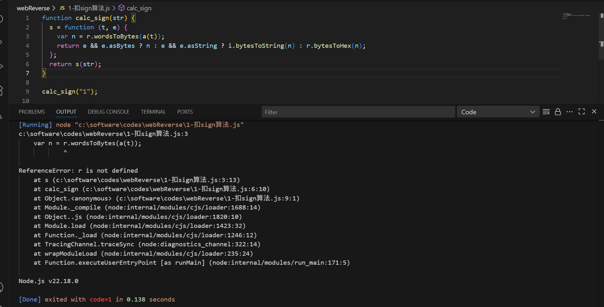

缺了 `r.wordsToBytes`和`a`

我们先补a吧

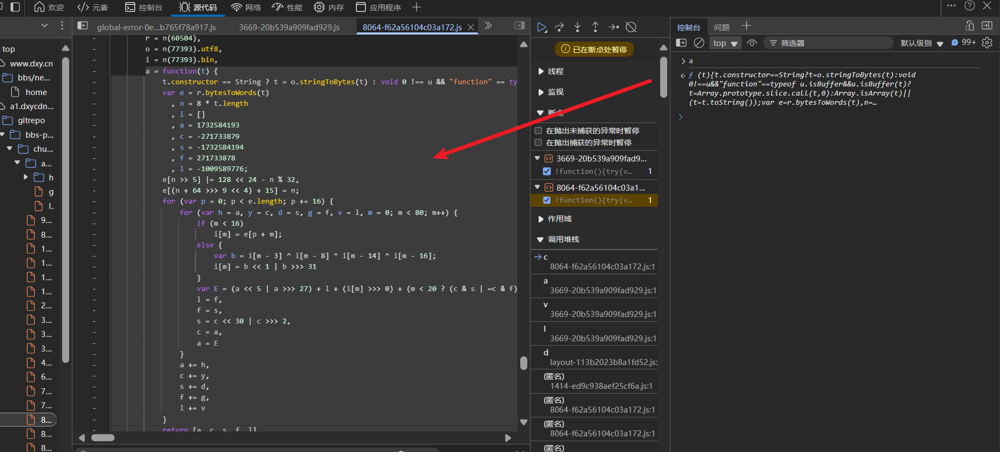

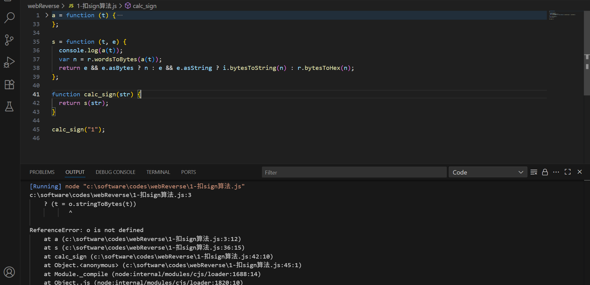

缺了`o.stringToBytes`

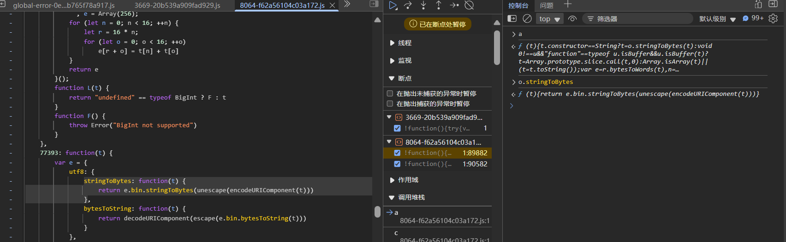

这个`e.bin.stringToBytes`没有

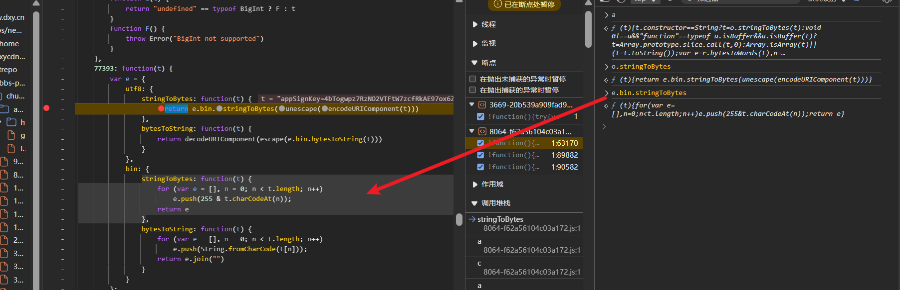

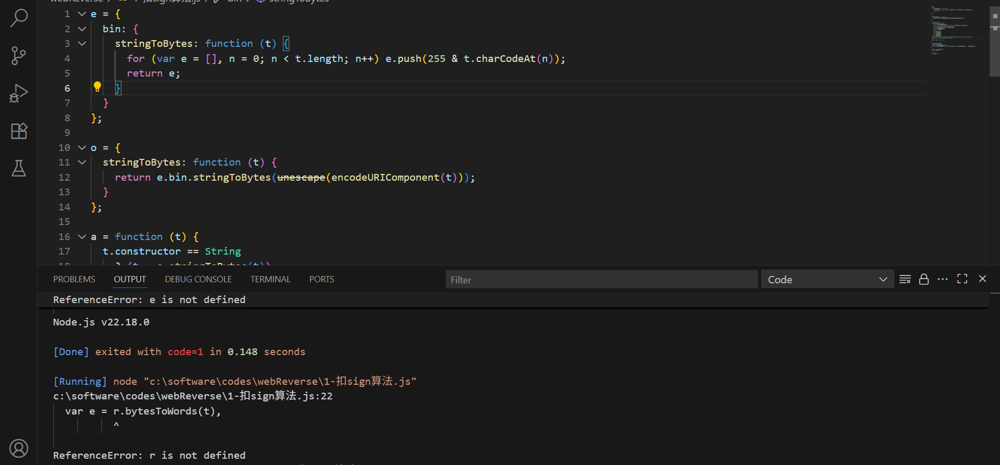

接下来是没有 `r.bytesToWords`

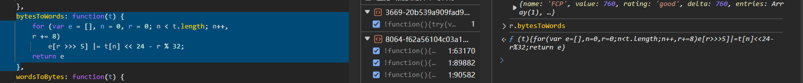

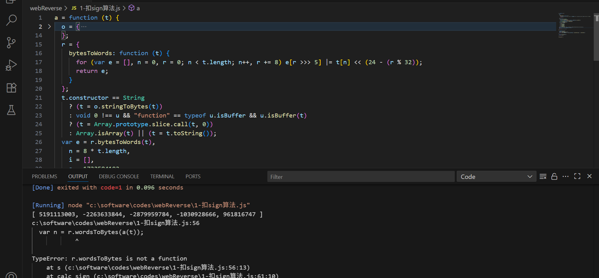

这里a(t)正常打印了，我们与js对比一下

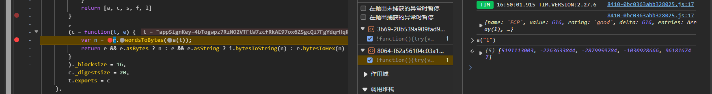

一样的，接下来是 `r.wordsToBytes`

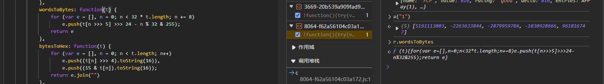

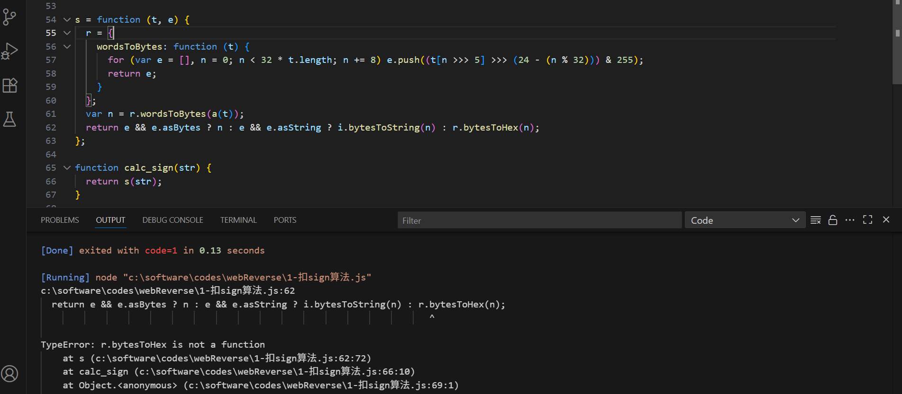

缺 `r.bytesToHex`

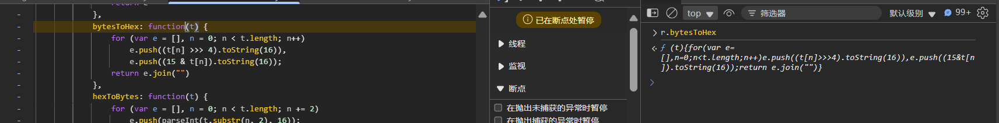

搞定了，对比js看看

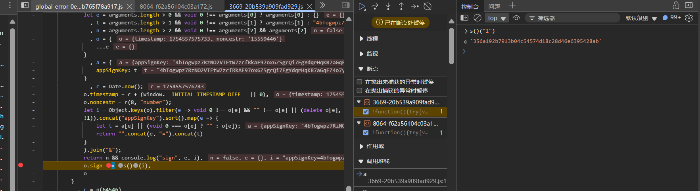

没啥问题，ok

接下来看明文如何拼接的

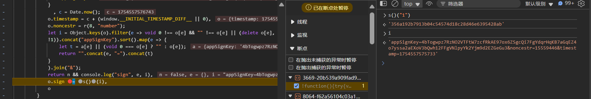

测试发现`i`的`appSignKey`是不变的

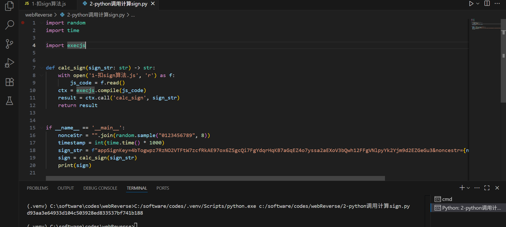

python写个调用逻辑就行

搞定了

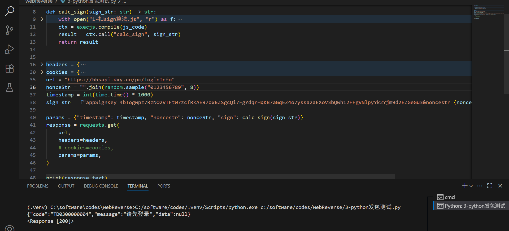

发包看看，这个返回也是正常的，和web段拿到的一样，搞定！