# 抓包分析

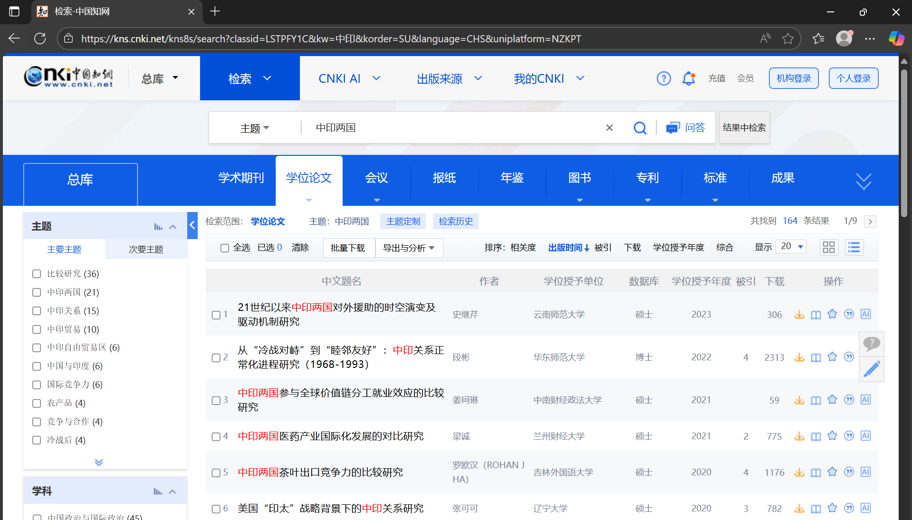

https://kns.cnki.net/kns8s/search?classid=LSTPFY1C&kw=%E4%B8%AD%E5%8D%B0&korder=SU&language=CHS&uniplatform=NZKPT

没啥好说的，查论文的需求多，所以直接看这个

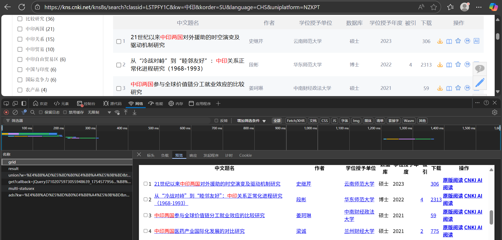

grid接口中有

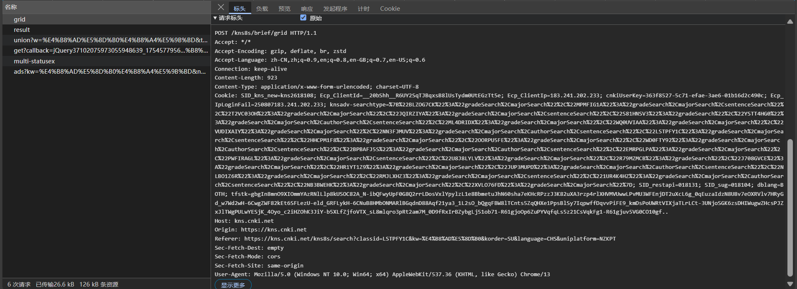

请求头没啥东西，主要是个cookie

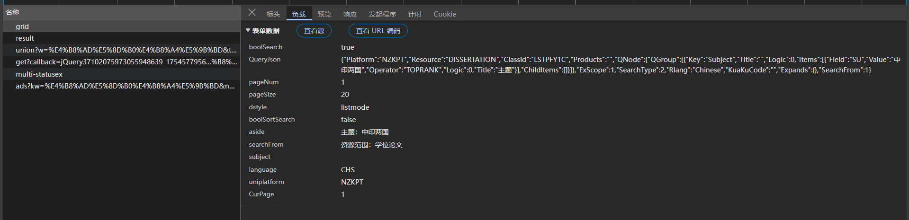

请求体的话，也没啥加密的

用python测试一下，直接就能拿到

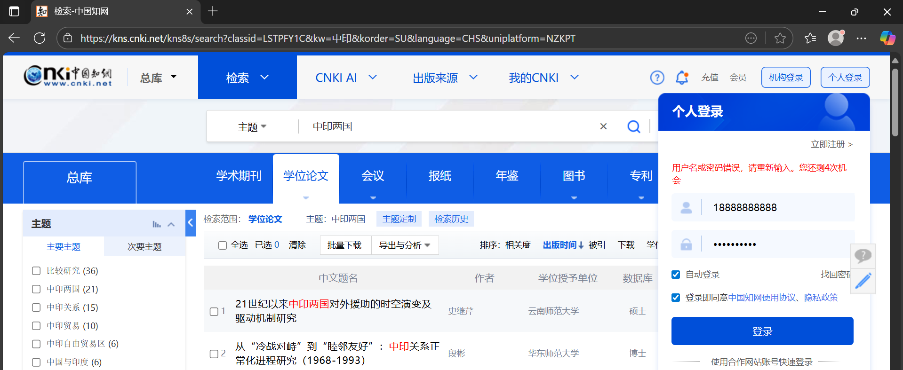

这里找登录接口试试

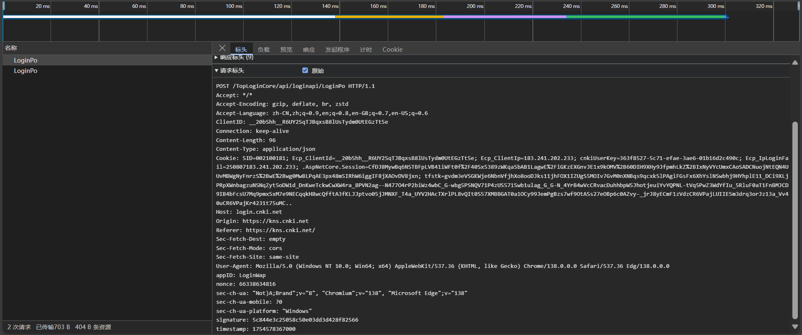

请求头参数主要是 `timestamp`、`nonce`、`signature`、`cookie`

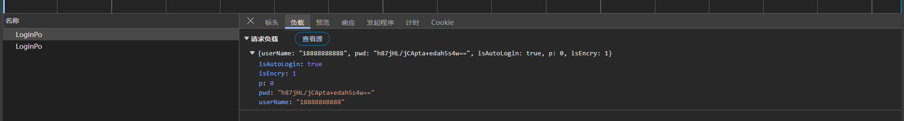

负载主要是加密了密码

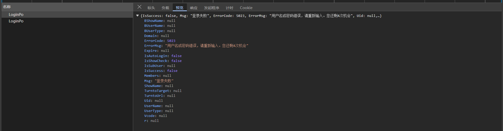

响应正常

转python代码看看

测试发现cookie不需要

那就看看请求体的密码加密吧

对了，测试发现还会弹验证码


# 密码加密

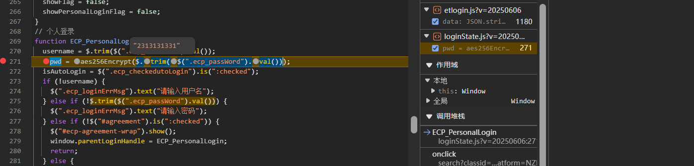

密码很好跟，就是一个aes256，跟发包堆栈就能看到了

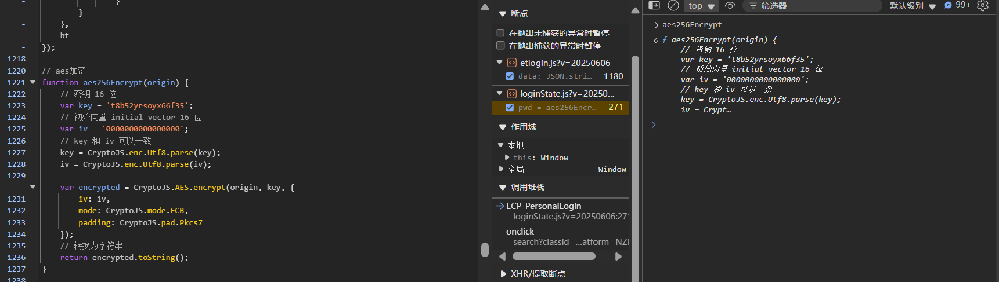

这是个标准库的aes

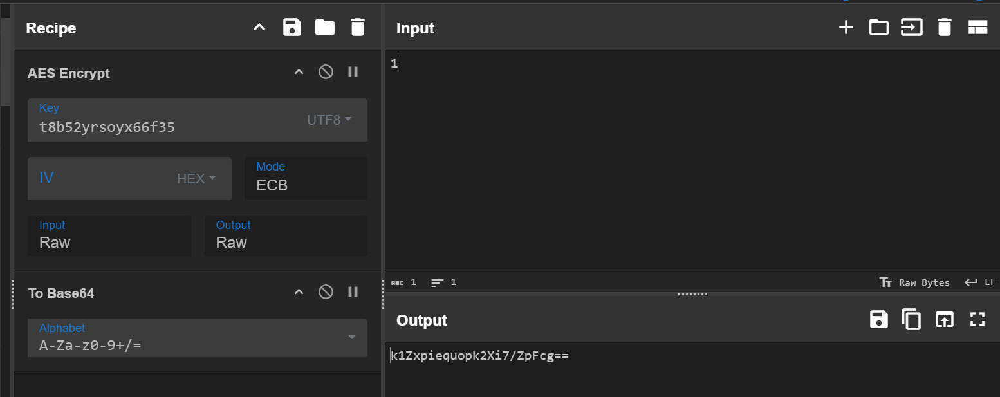

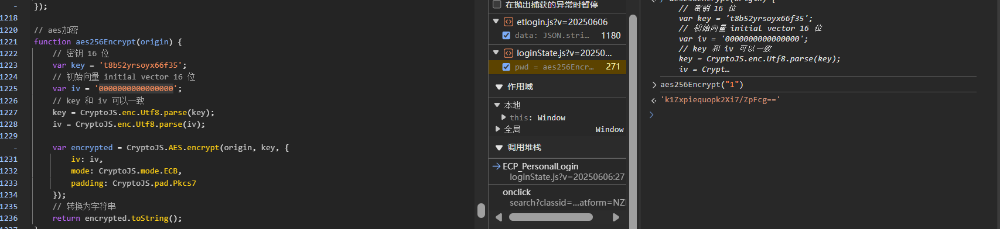

aes/ecb+b64

接下来用python实现

```python
import base64
from Crypto.Cipher import AES
from Crypto.Util.Padding import pad, unpad

def aes_ecb_encrypt(plain_bytes: bytes, aes_key: bytes) -> bytes:
    return AES.new(aes_key, AES.MODE_ECB).encrypt(pad(plain_bytes, AES.block_size))


def encrypt_pwd(password: str) ->str:
    return base64.b64encode(aes_ecb_encrypt(password.encode(), "t8b52yrsoyx66f35".encode())).decode()
```

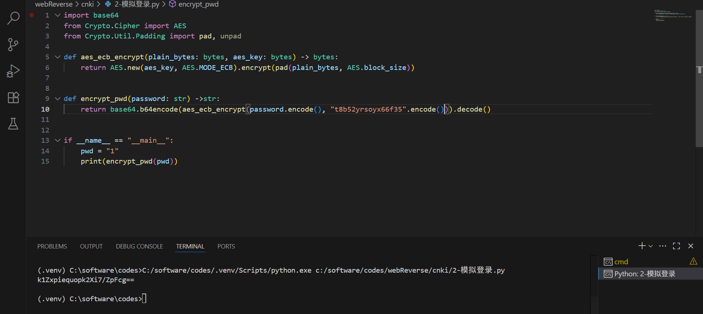


# 验证码

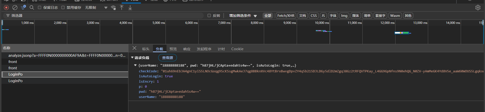

这里的checkCode就是验证码接口返回的

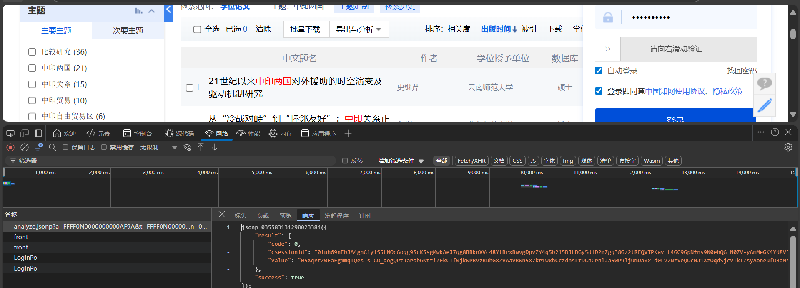

这个滑块成功的 `csessionid` 就是滑块信息了

看了眼滑块和域名，确定了是阿里231

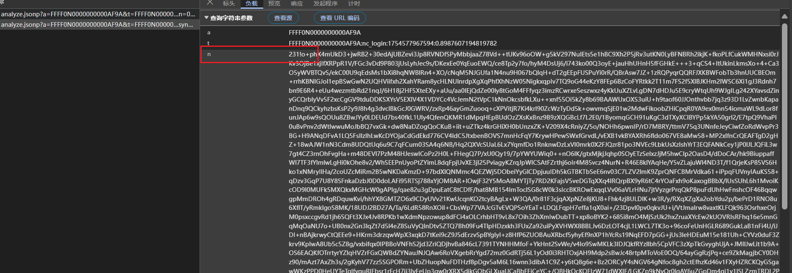

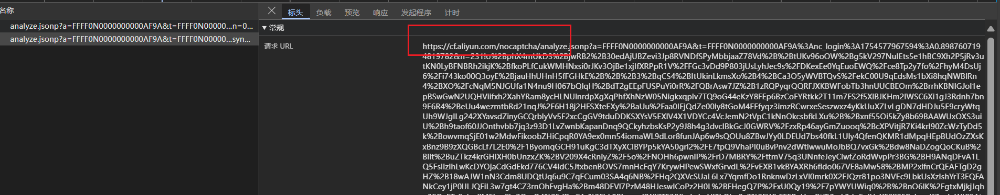

接下来就是分析阿里231，这里很难，等大佬带带

