# 抓包分析

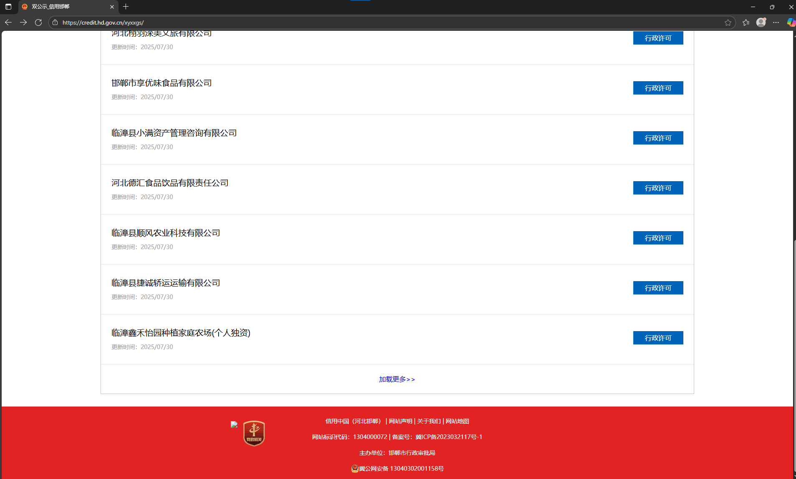

网站是这个

[双公示_信用邯郸](https://credit.hd.gov.cn/xyxxgs/)： https://credit.hd.gov.cn/xyxxgs/

也是gov，纯技术研究，github毕竟是个小众平台，我自己也懒得打码了；


点击加载更多，就一个包；请求头没啥参数


请求体一堆参数

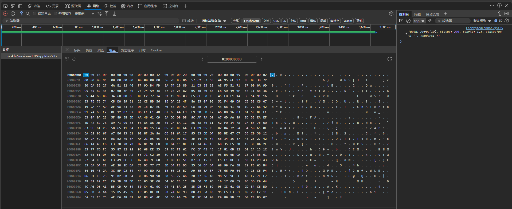

响应体二进制数据


# 请求体参数

## 初步分析

多抓几个对比一下

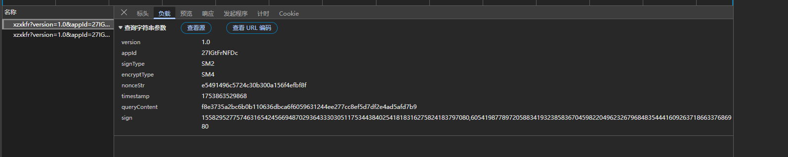


变化的主要是nonceStr，这个名字都不用仔细看，随机搞就行；

时间戳变了，是毫秒级别的；

queryContent也变了，仔细观察发现变化不大；

- `88e7484b6bd56df73e4672337fa76bde31244ee277cc8ef5d7df2e4ad5afd7b9`

- `f8e3735a2bc6b0b110636dbca6f6059631244ee277cc8ef5d7df2e4ad5afd7b9`

这里前半部分变化了，数一下长度，32；

这说明可能是分组加密；由于服务器要能解密；

所以猜测是aes，但是参数中有sm4，说明这个是走的一个sm4的加密；


我们继续看sign，是变化的，同样子，估计是sm2；

其实一般签名的话，sm系列用sm3用的多一些；


跟栈去找一下

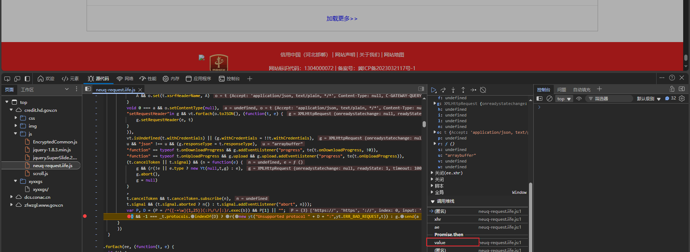

前面几个都没有的

跟到异步里面


`p[f]` 拿到第一个函数


这个拦截器里面是个switch，但是是按照顺序执行的，没有啥混淆；

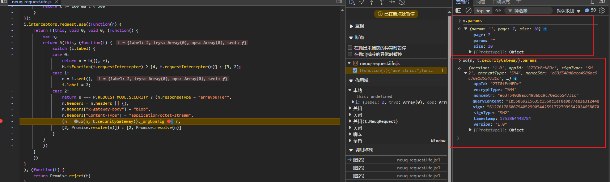

这里的n是原始参数，然后做了一个uo的加密，放进去了一堆参数；

接下来去跟uo函数就行


进到这里面，上面的n就是防止参数的地方；

```js
n = {
    version: P.NEUQ_GATEWAY_VERSION,
    appId: e.appId,
    signType: e.signType ? e.signType : P.SIGN_TYPE.SM2,
    encryptType: e.encryptType ? e.encryptType : P.ENCRYPT_TYPE.NONE,
    nonceStr: H.uuid(),
    timestamp: H.timeStamp()
}
```

没啥好说的，先简单跟一下nonceStr，虽然其实知道他是个uuid了，而且nonce一般都随机，随便搞一个就行，但是这里自己多跟一下积累经验；

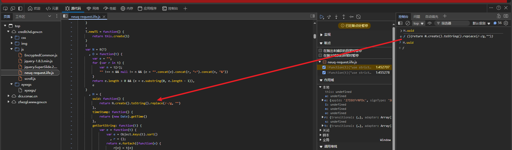

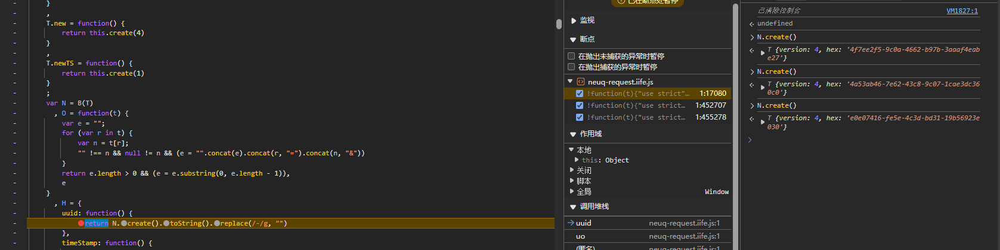

他这样子就是随机搞个uuid然后去掉-


python还原一下

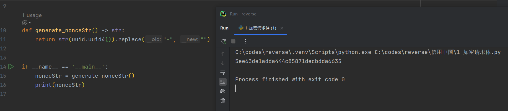


时间戳都不用看了

接下来去看queryConten和sign

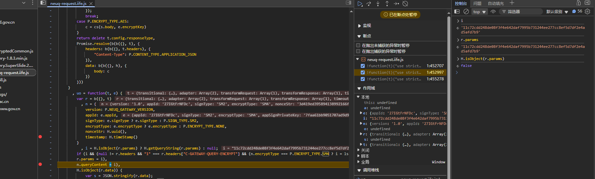

queryContent是i，然后控制台发现就是最后发包的数据了；

i是一个三目运算符得到的，

```js
i = H.isObject(r.params) ? H.getQueryString(r.params) : null;
```

这里右侧控制台发现是false，说明是null，走的下面的部分；

```js
if (i && (null != r.headers && "1" === r.headers["C-GATEWAY-QUERY-ENCRYPT"] && (n.encryptType === P.ENCRYPT_TYPE.SM4 ? i = ls.sm4.encrypt(i, e.encryptKey) : n.encryptType === P.ENCRYPT_TYPE.AES && (i = us(i, e.encryptKey)),
        r.params = i),
```

这里代码一坨屎；

主要是个三目运算符，后面两个都有i的赋值，


看了下是true，走的前面

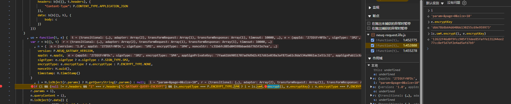

分析发现i是拼接的参数字符串

sm4的key是`dbb78b8b64d640bb130255c69e959973` ，接下来去验证一下是不是标准的sm4就行


这里与js验证发现是一样的，接下来用py还原；


搞定！

接下来去看sign是怎么搞的


下面就能看到，主要是o，但是又多个赋值点，我们都打上断点


其实也可以根据case来判断，肯定走的sm2嘛；

我们用控制台分析一下

主要是`ls.sm2.signature`函数先生成一个前面，然后再`Zi`函数进行处理；

一个一个跟


没啥好说的


长度也是128，和发包的一样，但是没用到appId，不知道可以用不


报错了，说明appId使用了的；

唉，那还是扣js代码吧


查了下说是可能用的是 `sm-crypto` 库，我们这里引入一下，然后python调用

```python
import subprocess
from functools import partial
import execjs

subprocess.Popen = partial(subprocess.Popen, encoding="utf-8")


with open("3-sm2签名.js", "r", encoding="utf8") as f:
    js_code = f.read()
ctx = execjs.compile(js_code)
sign = ctx.call('encrypt', sign_str)
params["sign"] = sign
```


搞定！

> 有空再分析一下python端的sm和js的区别


# 响应体解密

因为响应体解密后大概率是json数据，所以hook一下`JSON.parse`

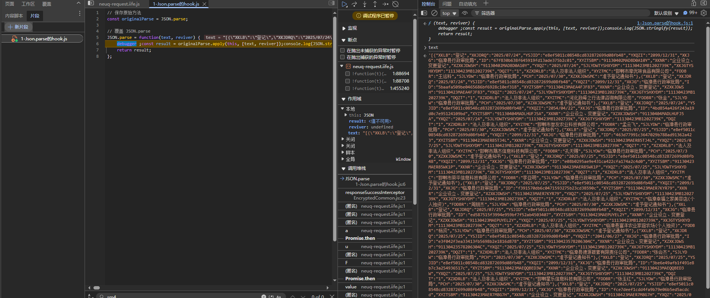

这个应该就是，跟栈找一下


这里已经解密了，继续跟

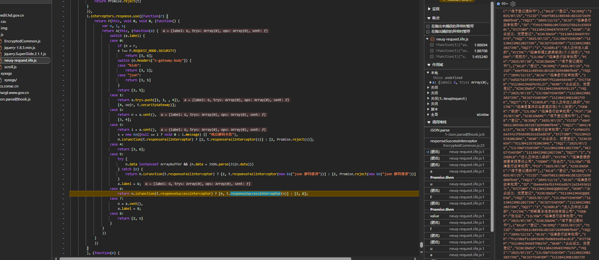

控制流混淆，这里直接全部都打上断点吧


这里的oo其实比较可疑

我们看下传入的参数r

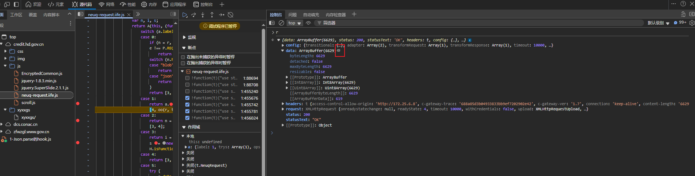

这个data就是了，可以点击图标跳转过去


然后和抓包对比


一样的，所以就是这里了

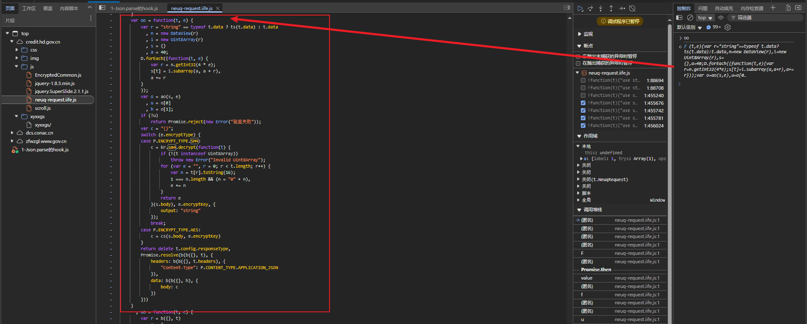

做了个sm4的解密

这里的r是二进制数据，arrayBuffer格式

接着我们断点到 `decrypt` 函数


把这个代码拿过去一执行，就是解密后的；

所以这是个sm4解密，接下来只需要看第一个参数，是怎么处理的二进制数据就行


代码还挺多的，不确定漏不漏东西，我们直接扣代码吧


首先是，这个oo函数传进来的是ArrayBuffer格式的，但是我们python没法构造，所以用其他编码转成字符串，js中解密并风斩成ArrayBuffer；

```js
let base64ToArrayBuffer = function (base64_str) {
    // 使用 atob() 解码 Base64 字符串为二进制字符串
    const binaryString = atob(base64_str);
    // 创建与二进制字符串长度相同的 ArrayBuffer
    const buffer = new ArrayBuffer(binaryString.length);
    // 创建 Uint8Array 视图来操作 ArrayBuffer
    const uint8Array = new Uint8Array(buffer);
    // 将二进制字符串的每个字符转换为 Uint8Array 中的一个字节
    for (let i = 0; i < binaryString.length; i++) {
        uint8Array[i] = binaryString.charCodeAt(i);
    }
    return buffer;
}

```

然后把r改了就行


这样格式就对了


这里用到了个D，是个全局变量的那种，扣下来

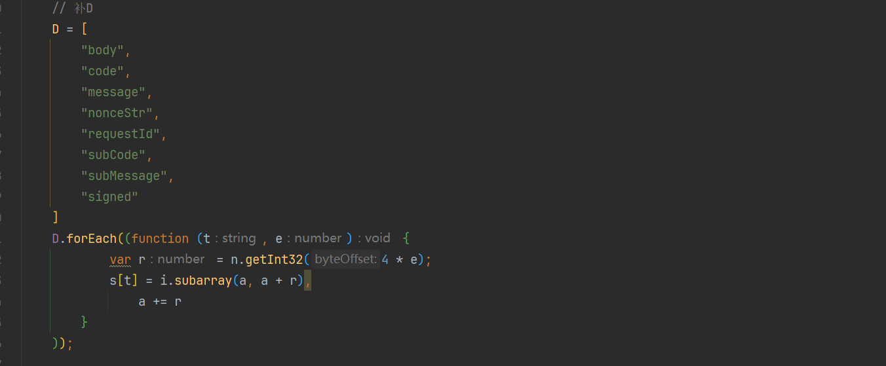

接着看ao这个函数


这个函数是做签名校验的，我们直接删了就行

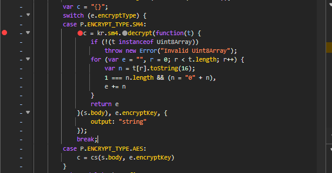

然后这里就用 `sm-crypto`库来进行调用就行了


先去python中拿一个b64数据过来


然后丢到js里面看看，缺啥东西


这里记得sm4的key直接扣出来就行了，然后就能正常显示了；看不懂的看小爬菜的视频就行

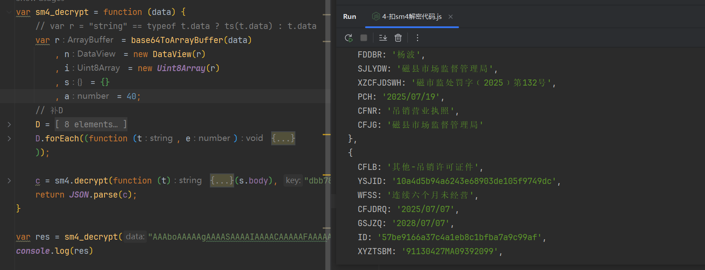

这里在做一个json.parse，打印出来更清楚;

其实这里就已经没问题了，但是我python的调用，编码有问题；

一时半会儿解决不了，遂直接用小爬菜的代码了；

重在过程吧，还行；