[热搜时光机 - 微博热搜历史记录查询](https://www.weibotop.cn/2.0/)：https://www.weibotop.cn/2.0/

因为这个案例蛋总录过视频了，我就写笔记吧，接下来就是一顿贴图了，hh；


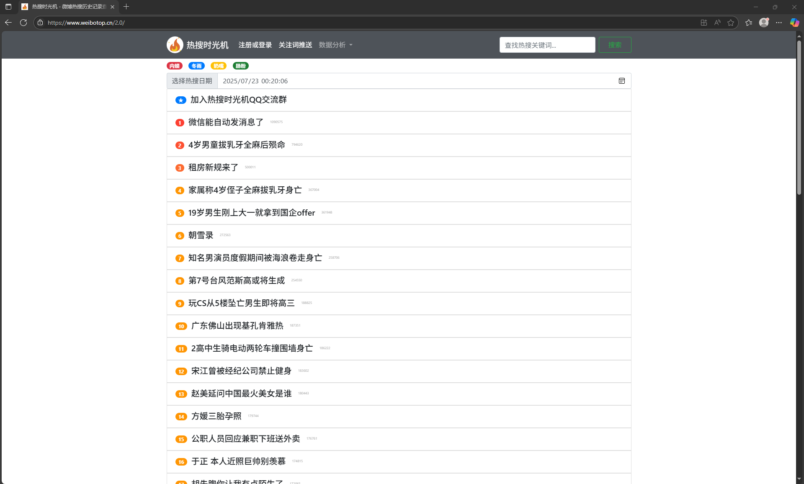

要抓的就是这里面的热搜数据


这里有个debugger；

原本我是使用魔改chrome无视debugger的，但是由于chrome的开发者工具的ui问题，所以切换到edge了；

那这里就手动去一下debugger吧；


点一下不暂停就好了；原理我也不知道，猜测是他这个debugger只有这一处吧；有的你去掉了之后他会弹一个新的出来；

总之，这里能直接过；

抓包看看


XHR中根本就没几个包，很明显就是最后一个了；


请求头没东西


响应体加密了，看样子是b64；这里根据算法特征分析一下；

要想解密：（1）简单编码：b64这种（2）对称加密 （3）非对称加密


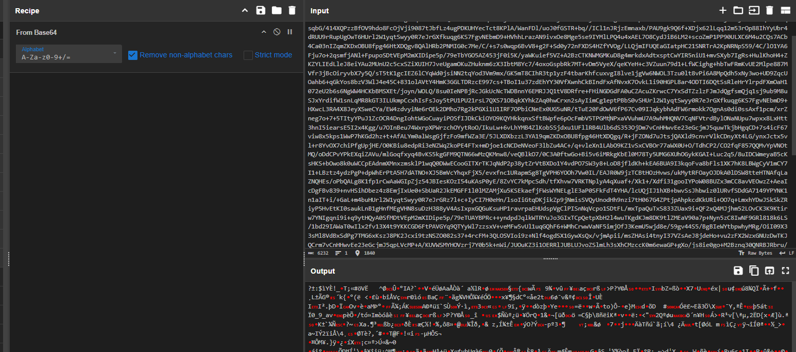

第一个很容易排除，解b64还是乱码；

我们换成hex，看看是不是对称加密，走了分组加密的aes那种

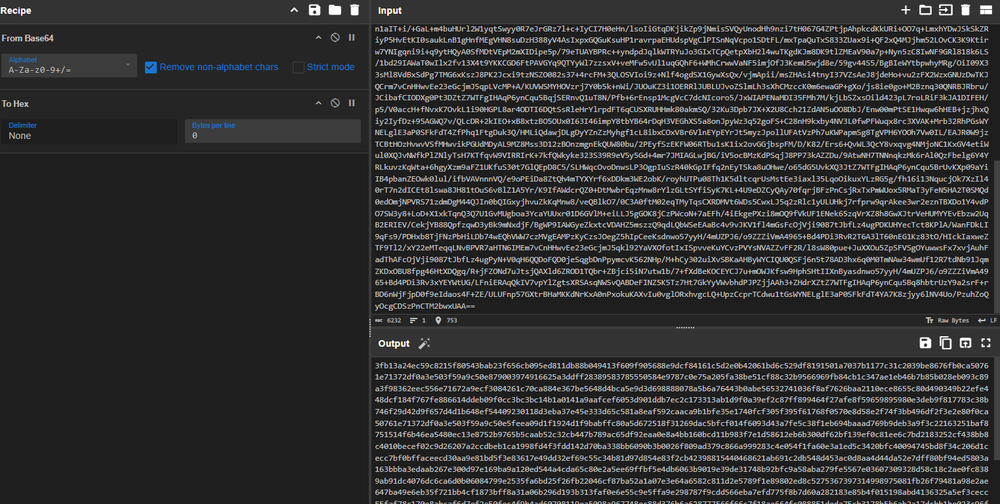

复制出来，丢进python


/2是因为十六进制，/16是判断是否可能是分组加密；

这里正好是，所以猜测aes；

这里可以用aes去搜，蛋总是用的 decrypt 去搜；

根据[小爬菜咦](https://space.bilibili.com/3546924980373556) 的hook `JSON.parse` [技巧视频](https://www.bilibili.com/video/BV1HwuczVE96/)，我们使用一下；

> 因为开发的时候接收这个数据是一个格式化的数据，一般都是要转成json的，所以会用到 `json.parse`；

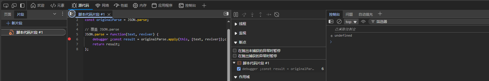

在这里加入代码片段

```js
// 保存原始方法
const originalParse = JSON.parse;

// 覆盖 JSON.parse
JSON.parse = function(text, reviver) {
    debugger ;const result = originalParse.apply(this, [text, reviver]);console.log(JSON.stringify(result));
    return result;
};
```

然后运行这个片段；或者直接扣代码丢控制台；

然后我们去换一天的热搜；


这种undefined跳过；

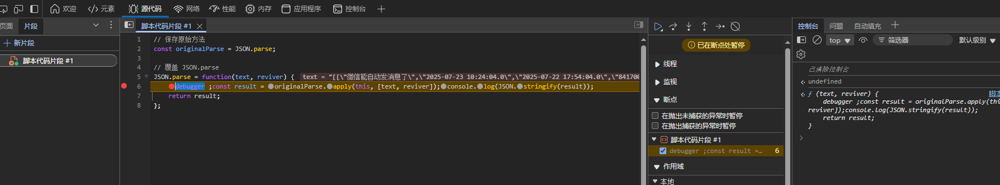

这个就比较像了；然后我们跟调用栈

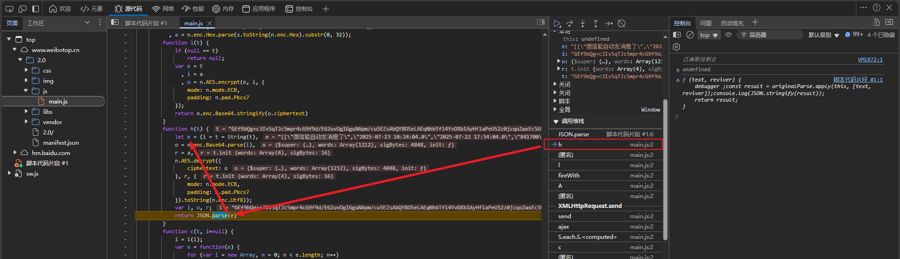

e这里好像用了个逗号表达式，所以返回值实际上是

```javascript
n.AES.decrypt({
    ciphertext: o
}, r, {
    mode: n.mode.ECB,
    padding: n.pad.Pkcs7
}).toString(n.enc.Utf8)
```

这里很明显是个aes；我也不太懂js端的各种加密怎么写的；

这里的密文是o，是个对象，很不友好...

ECB模式，所以我们只需要去找到key和密文就行了；


这里的o是先进行了b64的，然后解的是i

i=t，t看着是b64字符串，我们对比抓包


确实是这个，那我们的密文已经确定了；

走一个b64解码之后就作为aes的密文了；接下来找key

```js
n.AES.decrypt({
    ciphertext: o
}, r, {
    mode: n.mode.ECB,
    padding: n.pad.Pkcs7
}).toString(n.enc.Utf8)
```

这里面也就只能r作为key了，这也是个object，很不友好...

接下来分析r的来源吧


s是 `tSdGtmwh49BcR1irt18mxG41dGsBuGKS` 进行sha1，然后转hex，取前32位作为key；

但是aes的key是十六字节，所以我们要把2个字符看作一个字节

还原代码如下


接下来就是写发包脚本了


然后取爬虫工具库转python代码


```python
import requests


headers = {
    "accept": "*/*",
    "accept-language": "zh-CN,zh;q=0.9,en;q=0.8,en-GB;q=0.7,en-US;q=0.6",
    "origin": "https://www.weibotop.cn",
    "priority": "u=1, i",
    "referer": "https://www.weibotop.cn/",
    "sec-ch-ua": "\"Not)A;Brand\";v=\"8\", \"Chromium\";v=\"138\", \"Microsoft Edge\";v=\"138\"",
    "sec-ch-ua-mobile": "?0",
    "sec-ch-ua-platform": "\"Windows\"",
    "sec-fetch-dest": "empty",
    "sec-fetch-mode": "cors",
    "sec-fetch-site": "same-site",
    "user-agent": "Mozilla/5.0 (Windows NT 10.0; Win64; x64) AppleWebKit/537.36 (KHTML, like Gecko) Chrome/138.0.0.0 Safari/537.36 Edg/138.0.0.0"
}
url = "https://api.weibotop.cn/currentitems"
response = requests.get(url, headers=headers)

print(response.text)
print(response)
```


没啥问题，然后解密就行了


测试一下，其他都不需要带，带个ua就行；当然最好带着；


成功搞定

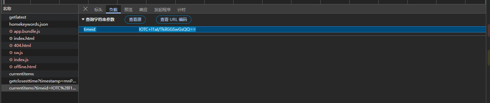

如果是不同天的话，有一个timeid参数

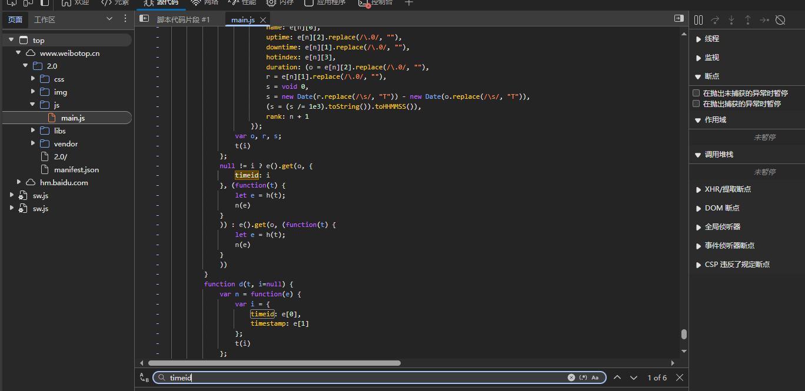

搜一下，感觉第一个比较像


确实是这里

往上跟


这个i是实践，然后经过了l函数


得到了b64字符串，我们看看i的变化

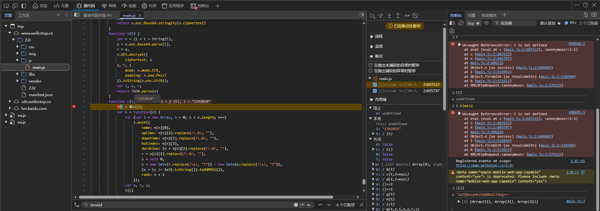

搞不定这个i是怎么来的，我们跟栈看看吧


跟过来，然后对比不同天的；

感觉不出来什么东西，丢给ai问问；


所以可能是某个接口返回回来的；不然客户端怎么确定具体的timeid呢；

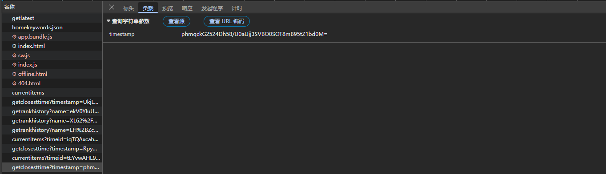


所以实际上在这个接口传进去了输入的日期和时间对应的时间戳；感觉是同一套算法，aes之类的；我们解密一下试试

前面拿到的key_hex是`a1aa63b395e053e0c3c67cf1366284a4`


很好

接下来就写脚本吧

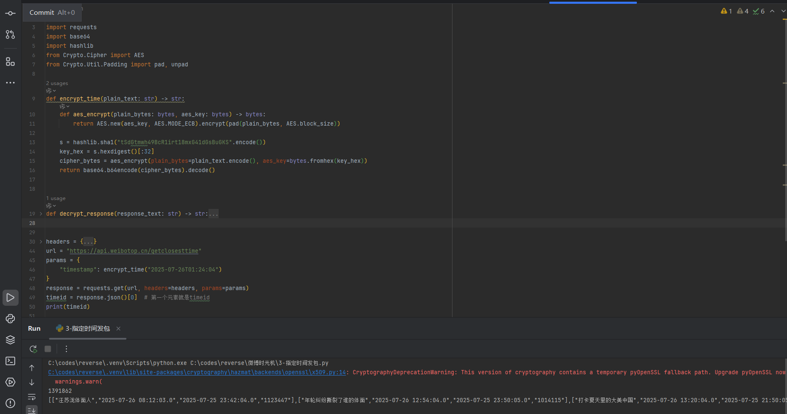

这下就可以按照我们的指定时间进行查询了

彻底完工！