# 抓包分析


网站的登录

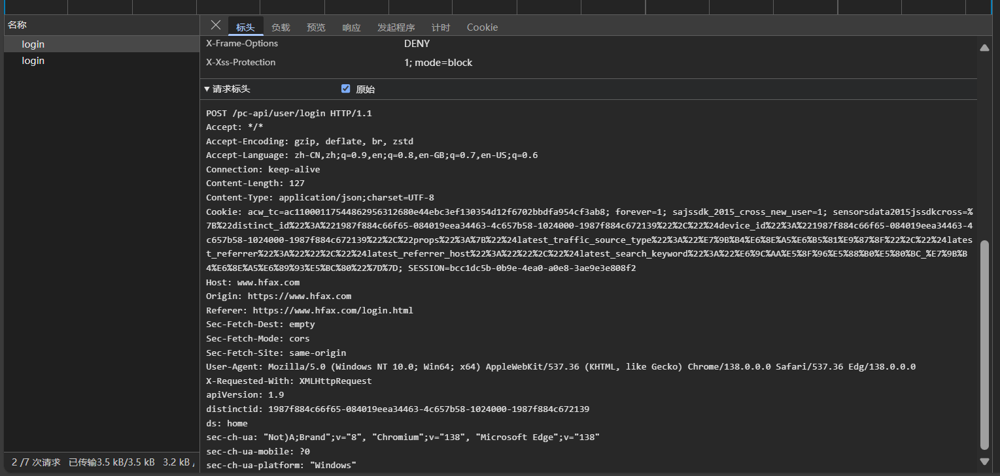

主要是这个`login`包；

请求头没啥特别的参数，这个distinctid也是不变的，我这里固定 `1987f884c66f65-084019eea34463-4c657b58-1024000-1987f884c672139`

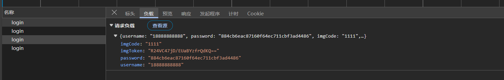

请求体中主要是imgToken和password

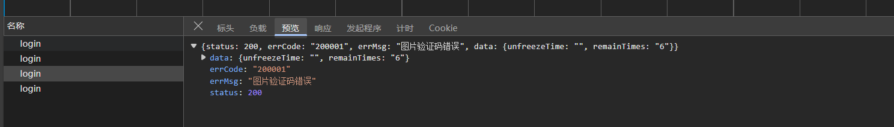

响应体也没加密，没啥大问题


# 识别验证码

我这里特意输错验证码，他的token是 `R24VC47jD/EUaBYzfrQdKQ==`，实际上是前面一个login拿到的


同样的接口，只要不带请求体就是返回验证码的信息

1. 我们先发包拿到图片吧

   右键接口 -> 复制 -> 复制curl(bash) -> 粘贴到爬虫工具库转requests代码

   ```python
   import requests
   from loguru import  logger
   
   headers = {
       "Accept": "*/*",
       "Accept-Language": "zh-CN,zh;q=0.9,en;q=0.8,en-GB;q=0.7,en-US;q=0.6",
       "Connection": "keep-alive",
       "Referer": "https://www.hfax.com/login.html",
       "Sec-Fetch-Dest": "empty",
       "Sec-Fetch-Mode": "cors",
       "Sec-Fetch-Site": "same-origin",
       "User-Agent": "Mozilla/5.0 (Windows NT 10.0; Win64; x64) AppleWebKit/537.36 (KHTML, like Gecko) Chrome/138.0.0.0 Safari/537.36 Edg/138.0.0.0",
       "X-Requested-With": "XMLHttpRequest",
       "apiVersion": "1.9",
       "ds": "home",
       "sec-ch-ua": "\"Not)A;Brand\";v=\"8\", \"Chromium\";v=\"138\", \"Microsoft Edge\";v=\"138\"",
       "sec-ch-ua-mobile": "?0",
       "sec-ch-ua-platform": "\"Windows\""
   }
   cookies = {
       "acw_tc": "ac11000117544862956312680e44ebc3ef130354d12f6702bbdfa954cf3ab8",
       "forever": "1",
       "sajssdk_2015_cross_new_user": "1",
       "sensorsdata2015jssdkcross": "%7B%22distinct_id%22%3A%221987f884c66f65-084019eea34463-4c657b58-1024000-1987f884c672139%22%2C%22%24device_id%22%3A%221987f884c66f65-084019eea34463-4c657b58-1024000-1987f884c672139%22%2C%22props%22%3A%7B%22%24latest_traffic_source_type%22%3A%22%E7%9B%B4%E6%8E%A5%E6%B5%81%E9%87%8F%22%2C%22%24latest_referrer%22%3A%22%22%2C%22%24latest_referrer_host%22%3A%22%22%2C%22%24latest_search_keyword%22%3A%22%E6%9C%AA%E5%8F%96%E5%88%B0%E5%80%BC_%E7%9B%B4%E6%8E%A5%E6%89%93%E5%BC%80%22%7D%7D",
       "SESSION": "bcc1dc5b-0b9e-4ea0-a0e8-3ae9e3e808f2"
   }
   url = "https://www.hfax.com/pc-api/common/imageCode/login"
   response = requests.get(
       url,
       headers=headers,
       # cookies=cookies
   )
   
   
   img_b64 = response.json()['data']['base64Str'].split("data:image/png;base64,")[-1]
   img_token = response.json()['data']['token']
   
   logger.success(f"验证码图片token: {img_token}, 图片b64: {img_b64}")
   
   ```

	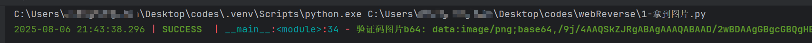

2. 接下来就是把b64字符串转为图片

   ```python
   img_binary = base64.b64decode(img_b64)
   img_filename = "2-验证码图片.png"
   with open(img_filename, "wb") as f:
       f.write(img_binary)
       logger.success(f"已保存验证码图片: {img_filename}")
   
   ```

3. 然后是识别验证码

   ```python
   # pip install ddddocr
   import ddddocr
   from loguru import logger
   
   
   ocr = ddddocr.DdddOcr(show_ad=False)
   
   with open("2-验证码图片.png", "rb") as f:
       img_binary = f.read()
   
   code = ocr.classification(img_binary)
   logger.success(f"验证码识别结果: {code}")
   
   
   ```

   

# 密码加密

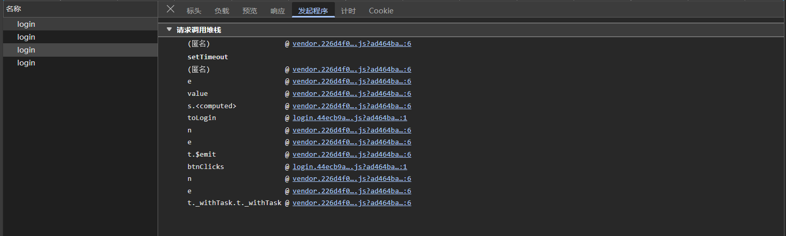

跟栈去找，直到toLogin

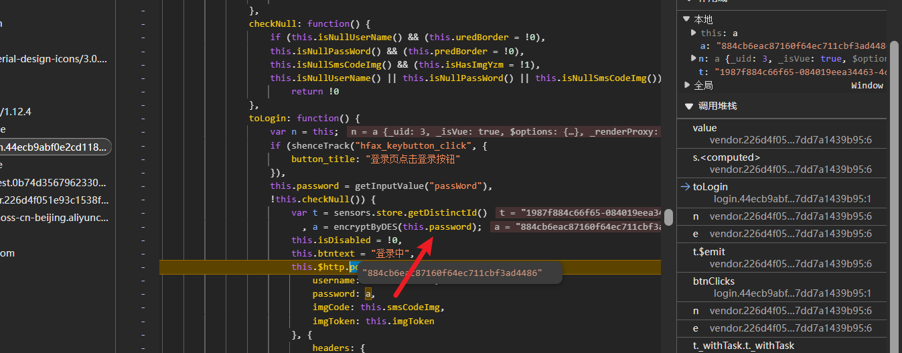

然后看一下这个函数

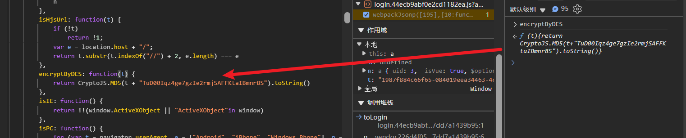

看样子是标准库的md5，只不过加盐了；去网站测试下

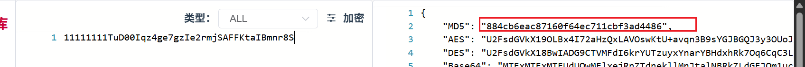

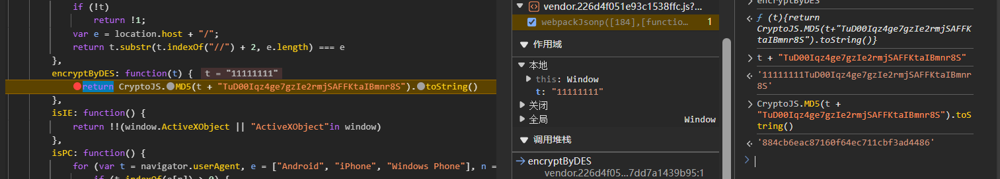

一样的，所以可以发登录包了

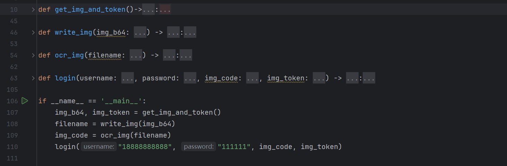

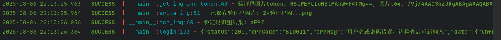

ok搞定

