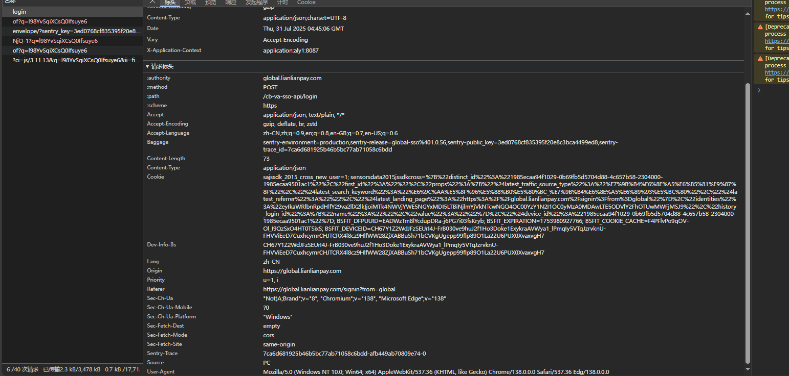
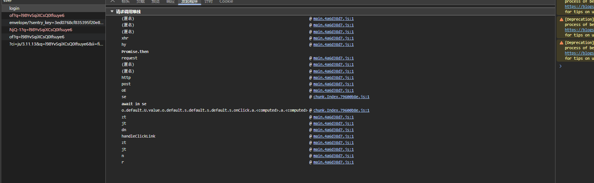
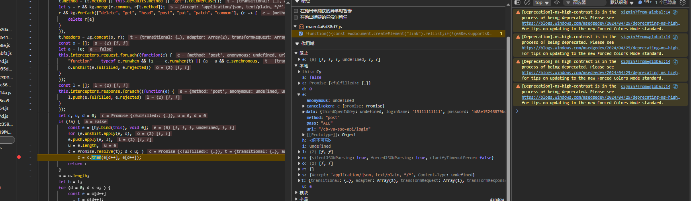
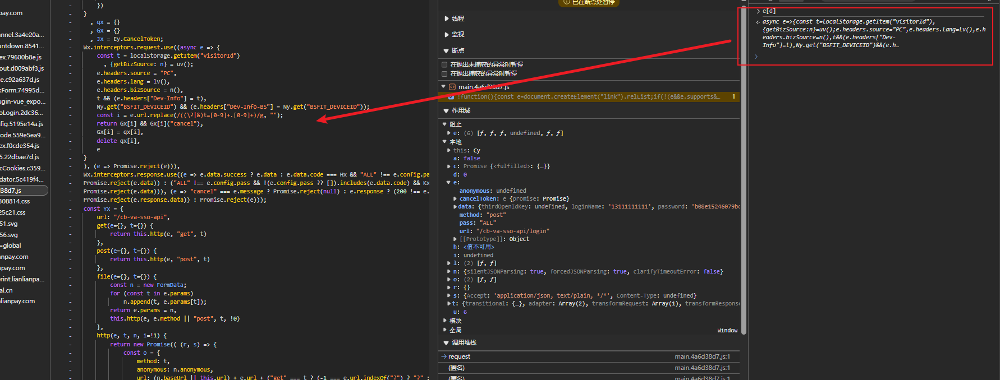
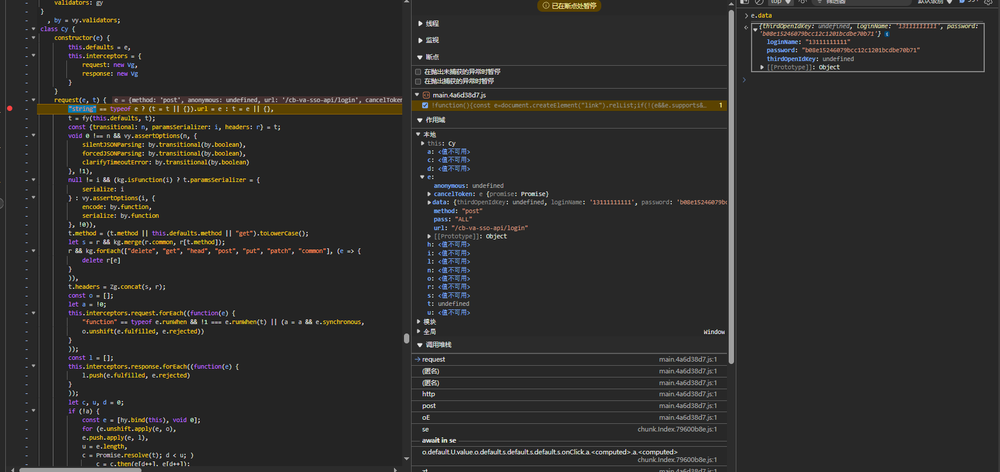
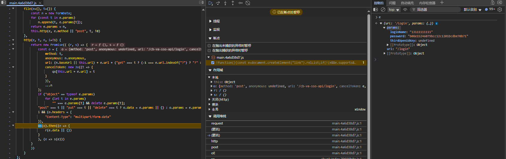
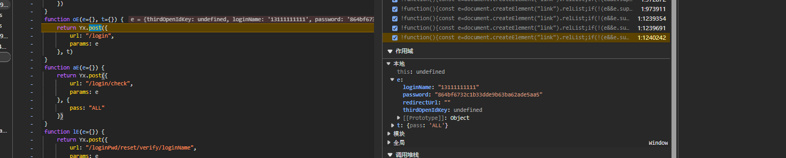
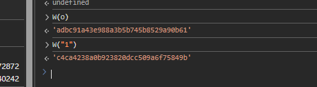

https://global.lianlianpay.com/signin?from=global

请求头有一个trace有点可疑，不过影响不大

响应体正常返回

开始跟栈，有一点异步

一路往上

跟到异步

玩上面打断点，看看怎么传进来的

发现这里已经加密好了，所以继续跟栈

接着跟

继续跟

找到了；这里的o是明文密码；

看这样子是md5；

所以就是一个2次md5，搞定

注意这里要验证他是不是对字符串进行编码后的；

有的是md5拿到字节流然后再md5；但是这个是前者；

